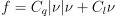

# Setup Files
The simulators refers to 2 types of file for setting up the simulations. Thhose files contain all the paramenter and charateristics that allow to personalize each simulatation as needed. The files are written in XML format. 
The philosofy is to allow the content of the file to coexisit whitin a standard URDF file, describing a specific robot  (agent) or simulation. Practical application of this principle is still ongoing. 

## Agent Description
The agent description file defines the charateristics of a type of agent. It is worth nothing that multiple types can coexist in a simulation, and multiple instances of the same type are also allowed. The agent description file is defined either at the initialization of an `Agent` instance or within the Simulation description file. If not specified the default.xml description provvided in this package is used instead. 

The Agent Description file need to have the `.xml` termination and XML format. It is structured as follows: 

<pre>
agent.xml 
└── data  
    ├── sim_agent
    └── sensors 
        ├── NNDetector
        └── Acoustic_Ranging
</pre>

`sim_agent` contains all the primary information regarding the agent, while `sensors` contains plug-in pecific charaterization parameters. It is worth noting that `sensor` can be populated even if those sensors are not imported in the simulation.

### `sim_agent` description
The following parameters are tunable in the sim_agent section:

#### Inertia and Drag

- `mass`: Dry mass of the agent in Kg
- `added_mass`: 2x2 matrix of the added mass of the agent, referring to the [u,v] linear & planar DoF (see Handbook of Marine Craft, Thor I. Fossen). Note that the convention used if for the diagonal element to be defined positive.
- `quadratic_damping`, `linear_damping`: 2x2 matrixes referring to the linear and quatratic dumping due to hydrodynamic drag. Following the formula. 
      
    Note that the convention used if for the diagonal element to be defined negative.


#### Controls
Following the controls schemes that can be directly emulated and associated parameters. It is worth nothing that all parameters can be popoulated. The simulator will require the control specifi parameters to be defined. the control type can also be altered during the simulation, thus the associated parameters specified in the xml for the new type of control will be adapted.

**Control - Depth**
- `depth_control`: type of control used. Options are "ideal", "step", "proportional", "heave"
- `step_depth`: speed of ascend/descend in m/s when "step" is selected
- `proportional_depth`: value of propotional control when "proportional" is selected. Input is depth error [m], output is heave velocity [m/s].
- `heave_limit`: Upper-Lower limit of heave velocity [m/s], when "proportional" is selected.

**Control - Heading**
- `heading_control`: type of control used. Options are "ideal", "step", "proportional", "yawrate"
- `step_depth`: speed of rotation yawrate in degrees/s when "step" is selected
- `proportional_depth`: value of propotional control when "proportional" is selected. Input is heading error [degrees], assuming shortest direction, output is yawrate velocity [degree/s].
- `yawrate`: Upper-Lower limit of yawrate velocity [degree/s], when "proportional" is selected.

**Control - Planar**
- `planar_control`: type of control used. Options are "ideal", "step", "local_velocity","inertial_velocity", "local_forces"
- `step_planar`: planar speed in m/s when "step" is selected
- `vel_limit`: 2-values, repesenting the surge and sway [u,v] velocity limit that the agent can reach. Applyed when "local_velocity" or "inertial_velocity" is selected.

#### Error/Noises
Error and noises of the feedbacks expected in the control schemes can be emulated defining the error parameters. Such noises are modelled as gaussian noise and bias added to the ground truth value and then applied as input in the control scheme. A generic noise is defined as:
- `e_<input>` = bias, standard deviation  

The noises input that can be defined are:
- `e_depth`
- `e_heave`
- `e_heading`
- `e_yawrate`
- `e_position`
- `e_local_vel`
- `e_inertial_vel`
- `e_local_force`

The exception is `clock_drift` which is defined as the drift of the internal clock as PPM

## Simulation Description
Each simulation is defined by a single simulation.xml file. The file is specified in the initialization of the `Simulation` class, and contains all the instructions to also initialize the agents. If not defined the simulation.xml file in this package is used as default.  

The simulation description file need to have the `.xml` termination and XML format. It is structured as follows: 

<pre>
agent.xml 
└── data  
    ├── environment_setup
    |   ├── global_waves
    |   └── local_waves
    ├── agents 
    |   └── agent_type
    └── seed
</pre>

### `environment_setup` description
The `environment_setup` stores all data relative to current and current disturbances affecting the agents kinematics in the simulation.

Uniform constant current
- `uniform_current` :2-Values defining the current component Direction North-East, value in m/s

Localized current disturbances and noise
- `noise_currents` :2-Values 

- `vortex_currents`


#### global_waves
Time dependand space independent sinusoidal wave-like disturbance. `global_waves` can contain a list of entries with arbitrary names. for conventions use `wave1`, `wave2` etc. Eack `wave` mush contain:

- `amplitude`: Peak current intensity in m/s
- `frequency`: Wave frequency, time based, expressed in Hz
- `direction`: Direction in degrees of the current disturbance
- `shift`: Offset on the wave timing, adimentional value between 0 and 2π

#### local_waves
Time and space dependand sinusoidal wave-like disturbance. `local_waves` can contain a list of entries with arbitrary names. For conventions use `wave1`, `wave2` etc. Eack `wave` mush contain:

- `amplitude`: Peak current intensity in m/s
- `wavelength`: Distance between 2 peaks, in [m]
- `wavespeed`: Wave velocity in m/s. (velocity of translation of the peaks)
- `direction`: Direction in degrees of the current disturbance
- `shift`: : Offset on the wave timing, adimentional value between 0 and 2π

### `agents` description
Section required to populate the simulation at initialization with agents. `agents` can contain a list of types, arbitrarelry named. For conventions use `agent_type`, `agent_type2` etc. Each `agent_type` must contain:

- `description`: Path to agent xml. Either global or local path can be used.
- `name`: Name prefix used by all agent of this type, inserted in this section. 
- `state`: 4xN matrix. The state is used to define the initial position of each agent.
    * 1 line : position [x,y,z] in [m], heading in [degree]
    * Each new line adds 1 extra Agent to the simulation

**Example of state**
```xml
    <state>
        <!-- x, y, z, psi -->
        0.0  0.0  10.0  10.0
        2.0  0.0  8.0  180.0
    </state>
```
2 Agents, Agent 1 placed on [0,0,10] heading 10 degree North, Agent 2 placed in [2,0,8] heading South. 

### `seed` and use of randomness pipeline
The seed value is an optional value. It is defined as an **integer value**. If not specified the random generator is reinitialized at each start of the simulation, which result on a different sequence of random values at each run.  
If specified, then all random based event in the simulation will be tied to the seed value, and provvided no variation of the simulation parameters, will return consistent return at repeated runs. The seed is inherited from the simulation to the agents added in `agents`. 