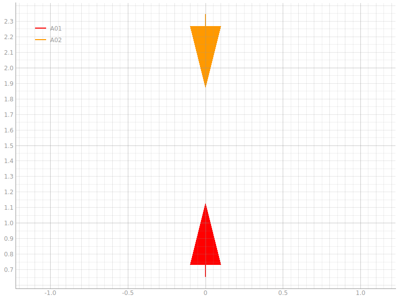

# Setting a Visualize 2D simualtion

In [create new](create_new.md) we have seen how to set a basic simulation.

The basic setting has no visual interface, nor it runs in real time, which doen not allow for human interpretation.
For this reason SwarmSwIM offers a 2D Visualizer plugin. The example.py is an implementation of the visualizer. 

lets create a new file: `my_first_animation.py`. We will use the `example.py` as template, and remove of the extra plugins and elements

```python
# my_first_animation.py

from SwarmSwIM import Simulator
from SwarmSwIM import Visualizer2D

PERIOD = 0.05 

# Start a Simulator instance with a 0.05 s period
S = Simulator(PERIOD)

# define cycle function
def cycle():
    # spin the simulation
    events = S.tick()
    # print all events of the step
    print(events)
    # execute a command
    S['A01'].set_ForceCmd(0.1)
    S['A02'].set_ForceCmd(0.1)

# ==============================
# set 2D real time visualization
# ==============================

# define proprieties for visualization
properties = {
    "bg_color": 'w', # background color (white)
    "grid": True, # add grid visualization
    "color_by_type": False, # set legend - False for individual names True for naming by type
    "record": False, # creade video recording
    }

# create visualizer
visualizer = Visualizer2D(S, cycle, properties=properties)
# runs simulation inside the visualizer
visualizer.run()
```
---

First we import a new element with:
```python
from SwarmSwIM import Visualizer2D
```
This imports the visualization plugin

---

As before we initialize the simulator:

```python
PERIOD = 0.05 
# Start a Simulator instance with a 0.05 s period
S = Simulator(PERIOD)
```

The way the visualizer work, it requires the execution cycle to be defined in a function (`cycle`), with no arguments and no output. the cycle function must contain the `tick()` execution, plus any user defined logic.

```python
def cycle():
    # spin the simulation
    events = S.tick()
    # print all events of the step
    print(events)
    # execute a command
    S['A01'].set_ForceCmd(0.1)
    S['A02'].set_ForceCmd(0.1)
```

In this case we add a force command and apply to the 2 agents. more details on setting a command in []()

---

Finally we define the visualizer. the visualizer takes 2 mandatory parameters, the Simulator instance and the callable of the cycle fucntion (function name without parenthesys). Additionally a dictionay can be passed to define the visual aspect of the Visualizer

```python
# define proprieties for visualization
properties = {
    "bg_color": 'w', # background color (white)
    "grid": True, # add grid visualization
    "color_by_type": False, # set legend - False for individual names True for naming by type
    "record": False, # creade video recording
    }

# create visualizer
visualizer = Visualizer2D(S, cycle, properties=properties)
```

In this example the propieties set the baground color and grid to be on. the legend is set so that each agent is represented individually (instead of by groups), and no video recording is saved.

---

to run the simulation we execute run:

```python
visualizer.run()
```

---

Try to run the script. A window should appear to show the top view representation of the system. and it should look as the following:

<p align="center">
  
</p>

In the terminal you will see printed empty dictionaries:

```
{}
{}
{}
...
```
This is because the Visualizer produces no output.

---

## Setting a background image

*ADD documentation*


---

## Test yourself

For yourself: try changeing background color in `bg_color`, set the legent to `"color_by_type": True`, and run with `"record": True` to save a mp4 reconding of the animation.

---

Next, how to [set your simulation envrioment](set_simulation_xml.md)